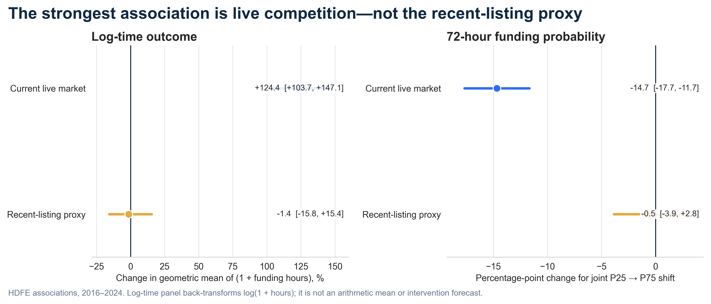
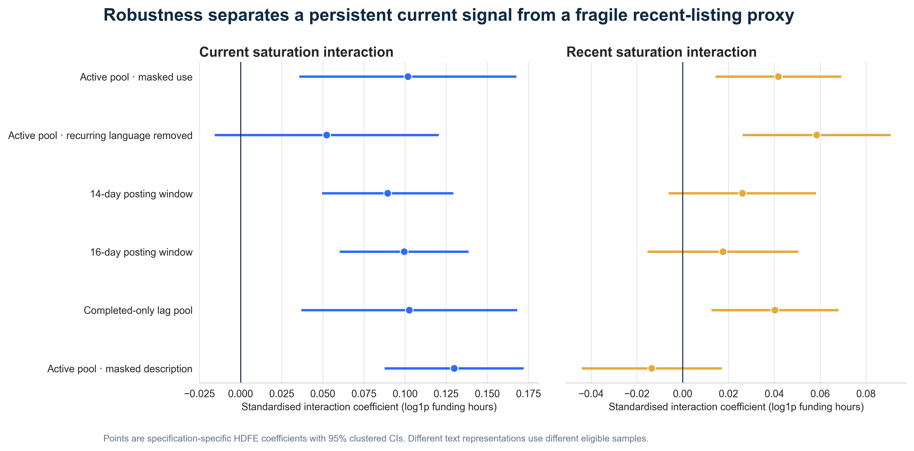

# When Every Story Sounds the Same

**📄 Project site → [https://bella10142003.github.io/kiva-narrative-saturation/](https://bella10142003.github.io/kiva-narrative-saturation/)** — the whole story on one page, the
[full report](https://bella10142003.github.io/kiva-narrative-saturation/report.html), and the
[presentation deck](https://bella10142003.github.io/kiva-narrative-saturation/site/Kiva_Presentation_v3.0.pdf) (20 slides).

**Narrative saturation and funding speed on Kiva** — UNSW Marketing Analytics Hackathon 2026, Team *5 GUYS*.

> 中文说明（更详细，含逐步骤导读）：**[README.zh-CN.md](README.zh-CN.md)**

Kiva borrowers compete for lender attention. This project asks whether a loan is funded more slowly
when the loans it competes against are not merely **numerous** but also **narratively similar** — when
every story on the page sounds the same. For each of **1,453,846 loans (2016–2025)** we rebuild the
exact market that existed at the moment it went live, and test saturation as the *interaction* of pool
volume and pool homogeneity.



---

## Run the validation yourself — about 90 seconds

The competition data cannot be redistributed, so nothing here would be checkable on its own. Instead the
repository ships the **simulation harness we built before touching the real data**: it generates synthetic
loans with the true coefficients planted in them, runs the full pipeline against that data, and scores every
estimate against a ground truth the pipeline is never allowed to read.

```bash
git clone https://github.com/Bella10142003/kiva-narrative-saturation.git
cd kiva-narrative-saturation
pip install numpy pandas scipy scikit-learn
bash run_demo.sh
```

No competition data, no credentials, ~90 seconds end to end. Output lands in `6_模拟验证/_run/`.

---

## What the simulation found — and why it changed the design

This is the part of the project worth reading first. Twenty thousand synthetic loans were built with six
things deliberately planted in them, each one turning a sentence of the proposal into a falsifiable claim:
known coefficients β₁…β₆, an unobservable sector-week demand shock, 72 lending partners whose template
intensity and funding speed move together, template share rising year over year, 8.9 % unfunded loans, and
a true signal that lives in the `use` field rather than `description`.

Running the proposed method against it produced an uncomfortable result:

| Specification | Estimate of C (market crowding) | Planted truth |
|---|---|---|
| Active pool — *the proposal's headline spec* | **0.444** | 0.138 |
| Active pool, controlling for the true shock (cheating benchmark) | 0.089 | 0.138 |
| **Mirror pool** — built only from posting time, so outcomes cannot contaminate it | **0.107** | 0.138 |

The headline specification overstated crowding by roughly **3×**, and the cheating benchmark proved the bias
came from exactly the shock we had planted. The mirror pool recovered a near-unbiased estimate *without
knowing the shock existed* — at the cost of attenuating homogeneity (H falls from 0.170 to 0.054). That is a
stated trade: **accept coefficient attenuation to remove endogeneity bias.**

Fourteen methodology components were scored this way. **Three earned their place, four were pure no-ops, five
were written in a way that would mislead, and two actively made the estimates worse.** Cutting the dead weight
roughly halved the analysis workload without losing a single defensible conclusion. The full verdict — component by
component, including a section on what this simulation *cannot* answer — is in
[`6_模拟验证/SIMULATION_VALIDATION.md`](6_模拟验证/SIMULATION_VALIDATION.md).

---

## Headline results on the real data

| | Estimate | Reading |
|---|---|---|
| **RQ1 — active pool** (`C×H`) | β = **0.1017**, p = 0.0033 | Moving volume and homogeneity together from P25 → P75 lengthens time-to-funding by **+124.35 %** [103.71, 147.08] |
| **RQ2 — recent / completed pool** (`V×G`) | β = **0.0417**, p = 0.0037 | Survives, and *strengthens* to **0.0585** (p = 0.0007) once lending-partner template language is stripped. Market-level **wear-out**, not just live competition |
| **RQ2 joint scenario** | −1.42 % [−15.81, +15.43] | Crosses zero because β<sub>V</sub> > 0 and β<sub>G</sub> < 0 offset each other — **not** evidence of no association |
| **RQ3 — 2016–2025** | annual marginal effects | [`rq3_year_effects.csv`](5_最终交付包/MA-Hackathon-Final-2026-09-04/outputs/rq3_year_effects.csv) |
| **RQ4 — where it bites** | sector × country | [`rq4_sector_effects.csv`](5_最终交付包/MA-Hackathon-Final-2026-09-04/outputs/rq4_sector_effects.csv) · [`rq4_country_effects.csv`](5_最终交付包/MA-Hackathon-Final-2026-09-04/outputs/rq4_country_effects.csv) |
| **2025 out-of-sample** | **negative result** | Adding narrative features worsens 6 of 7 metrics (R² 0.5524 → 0.5370; AUC 0.8986 → 0.8921). Reported as found |

Presentation deck: [`Kiva_Presentation_v3.0.pdf`](site/Kiva_Presentation_v3.0.pdf) — 9 slides plus 11 appendix
slides (model equation, specification checks, boilerplate rule, year-by-year regime shift, sources) ·
42 result tables: [`outputs/`](5_最终交付包/MA-Hackathon-Final-2026-09-04/outputs/) ·
8 figures: [`figures/`](5_最终交付包/MA-Hackathon-Final-2026-09-04/figures/) ·
full report: [`REPORT.en.md`](5_最终交付包/MA-Hackathon-Final-2026-09-04/REPORT.en.md) ·
methods: [`METHODS_APPENDIX.md`](5_最终交付包/MA-Hackathon-Final-2026-09-04/METHODS_APPENDIX.md)

### Robustness



Six alternative specifications — masked `use`, recurring language removed, 14- and 16-day posting windows,
completed-only lag pool, masked `description`. The current-pool signal holds across all six; the recent-pool
proxy is the fragile one, and the figure says so rather than hiding it.

---

## Method in one screen

For each focal loan we build two competitor pools within the same sector:

| Channel | Pool | Volume | Homogeneity | Saturation |
|---|---|---|---|---|
| `current` | loans live on the platform at that same moment | `C` = log(1 + pool size) | `H` = mean cosine similarity of the focal description to the pool (z-scored) | `C × H` → **RQ1** |
| `recent` | loans that went live 35–65 days earlier, 7-day half-life weights | `V` | `G` | `V × G` → **RQ2** |

**Why 35 days.** Training-period fundraising duration P95 = 826.891 h = 34.45 days, rounded up to 35. Every loan
in the lagged pool therefore has a ≥ 95 % chance of having finished fundraising before the focal loan appeared,
so it cannot mechanically drive the focal outcome.

**Estimation.** High-dimensional fixed effects — country + activity + week — with eight controls (amount, lender
count, term, platform volume, gender, repayment interval, weekday, hour) and two-way clustering on country ×
week. `pyfixest` 0.60.0.

**Discipline.** Variable definitions were **frozen before any result was inspected**
([step 03](3_分析步骤/03_冻结变量定义.ipynb), [`frozen_spec.csv`](5_最终交付包/MA-Hackathon-Final-2026-09-04/outputs/frozen_spec.csv)).
Pool algebra is checked against brute-force recomputation (max absolute error 2.89e−14 against a 1e−9 threshold).
The source `.pkl` is statically scanned for dangerous opcodes before it is ever deserialised
([step 00](3_分析步骤/00_安全审计pickle.ipynb)). Final QA is 20 deterministic gates, of which 19 pass.

---

## Repository layout

Folder names are Chinese; each folder has a `README.md` in English saying what is inside and what to open first.

| Path | Contents |
|---|---|
| [`1_题目与数据/`](1_题目与数据/) | **Brief & data** — data dictionary and original instructions. Raw data is not included, see *Data availability* |
| [`2_提案/`](2_提案/) | **Proposal** — the submitted proposal PDF (the single source of truth), requirements checklist, compliance matrix, assumptions and evidence logs |
| [`3_分析步骤/`](3_分析步骤/) | **Analysis pipeline** — 18 numbered notebooks, `00` → `17`, run in order |
| [`4_中间产物/`](4_中间产物/) | **Intermediates** — EDA scripts and tables, recomputation checks, audit manifests. Bulk `.parquet` excluded, regenerable |
| [`5_最终交付包/`](5_最终交付包/) | **Final deliverable** — the English report, methods appendix, deck, 42 tables, 8 figures, SHA-256 manifest, 20-gate QA, and a clean `src/` of 18 modules |
| [`6_模拟验证/`](6_模拟验证/) | **Simulation validation** — the harness `run_demo.sh` drives, plus the written verdict on all 14 components |
| [`7_审查记录/`](7_审查记录/) | **Review log** — independent review rounds, including the ones that failed |
| [`8_答辩准备/`](8_答辩准备/) | **Q&A preparation** — anticipated judge questions and answers |
| [`docs/`](docs/) | Working rules for the team: competition rules of record, drafting and review protocols, onboarding guide |
| [`site/`](site/) | Assets for the project site: the deck as PDF, figures, slide previews |

Four steps carry most of the technical weight:
[03 freeze definitions](3_分析步骤/03_冻结变量定义.ipynb) ·
[05 build pool features](3_分析步骤/05_构造池特征CHVG.ipynb) ·
[07 main HDFE model](3_分析步骤/07_主模型HDFE.ipynb) ·
[11 counterfactual support check](3_分析步骤/11_反事实支撑域检查.ipynb)

---

## Reproducing the full analysis

```bash
bash 建立环境.sh            # Python 3.13.3 venv + 15 pinned deps (requirements-lock.txt)
```

Place `Kiva_Loans.pkl` at `1_题目与数据/Kiva_Loans.pkl`, then run the notebooks in
[`3_分析步骤/`](3_分析步骤/) in numeric order. Paths are hard-coded relative to the repository root; nothing
needs editing. In VS Code, select the kernel **`Kiva 竞赛 (.venv)`**. Full runbook:
[`RUNBOOK.md`](5_最终交付包/MA-Hackathon-Final-2026-09-04/RUNBOOK.md).

## Data availability

The source dataset (`Kiva_Loans.pkl`, 1.49 GB, 1,453,846 × 27) is **competition material and is not
redistributed here**, and neither are the ~370 derived `.parquet` files, which the notebooks regenerate.
Everything committed is either our own code and writing or **aggregate** output — coefficients, quantiles,
counts, and n-gram frequencies only above a document frequency of 24,000. No individual loan text, borrower
name, or row-level record is published.

Kiva loan data is owned by [Kiva](https://www.kiva.org/); the brief and dataset were supplied by UNSW for the
2026 Marketing Analytics Hackathon.

## Known gaps

Carried over from [`7_审查记录/`](7_审查记录/) round 4 rather than papered over:

- The **joint** V / G / V×G test that RQ2 specifies is not yet written into an artifact.
- RQ4's second question — whether the attention market runs *within sector* or *platform-wide* — has no output.
- Final QA is **19/20**: the PPTX render gate needs a Node environment (review log R-01).
- Step 09's out-of-sample check uses an SGD prediction model. It does **not** cross-validate step 07's HDFE
  conditional association, and is not presented as if it did.

## A note on redaction

Before publication, absolute local paths of the form `/Users/<name>/Desktop/...` were replaced with
`<PROJECT_ROOT>` / `<HOME>` in 19 files (audit manifests, reproduction notebooks, two review notes), and student
IDs were removed from the proposal PDF and from `2_提案/证据来源.md`. Those files' hashes therefore differ from
[`MANIFEST_SHA256.txt`](5_最终交付包/MA-Hackathon-Final-2026-09-04/MANIFEST_SHA256.txt); the unmodified submitted
package is retained offline. No numeric result was altered.

## Team

**5 GUYS** — Ruohan Wang · Ruiyang Zheng · Hongxin Luo · Yiou Liu · Jingzhi Hu
UNSW Sydney, 2026.

## License

Code and written material: [MIT](LICENSE). This does not extend to the Kiva dataset or to the UNSW competition
materials, which remain the property of their respective owners.
